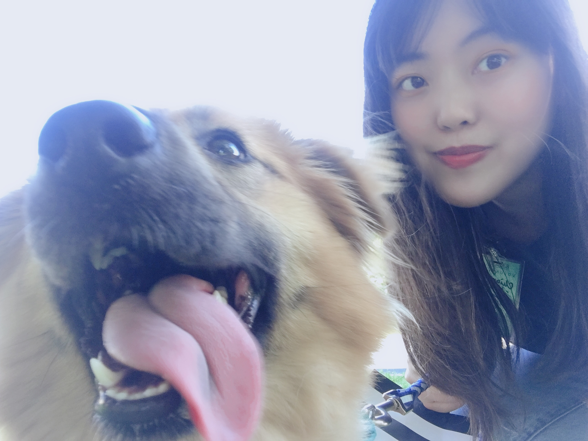
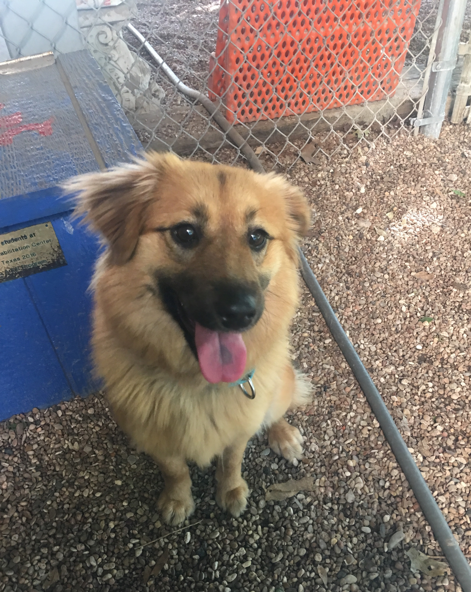
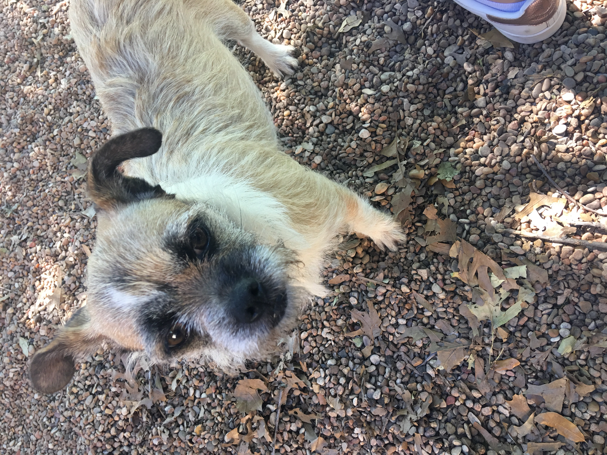

Hi, I’m Sharon.
I am originally from Taipei, Taiwan. From a young age, I have always enjoyed exploring different interests and experiences. Growing up, I participated in dance, choir, drama, and piano, and one of my favorite childhood memories was performing with my school choir at Taipei Arena, a major indoor venue in Taipei for concerts and public events.

In 2018, during my second year of high school, I moved to Austin, Texas, and began a new chapter of my life in the United States. As I adjusted to a new environment, I volunteered at an animal shelter with friends, and one of the most meaningful parts of that experience was seeing the animals I cared for find new homes. In 2019, I also received a Regional Medal at the Texas VASE Regional Competition, which reflected my continued love for art and creativity.

Volunteer - Austin Humane Society (2019)

Texas VASE Regional Competition (2019)

Outside of school and work, I enjoy drawing, photography, cooking, singing, and watching anime. These interests continue to shape how I see the world and how I express myself.

Some Photography

My college years brought many meaningful experiences, especially after I transferred to The University of Texas at Dallas. During my time at UTD, I grew through volunteering, creative projects, academic achievements, and hands-on experiences that eventually led me to continue into the MSBA program.

Volunteer - Feed My Starving Children (2023)

Volunteer - AIESEC Summer Camp (2023)

This website is a space where I share both my professional journey and the experiences that have shaped who I am. I’m glad you’re here, and I hope this page helps you get to know me a little better. 😊

---
