<a href="Projects.html" class="learn-more-btn">Back to Projects</a>

## Project Overview

FleetPride is one of the largest distributors of aftermarket heavy-duty truck and equipment parts in North America. This project focuses on developing a pricing analytics and price-elasticity framework to help the company better understand how pricing decisions affect demand, revenue, and profitability.

The goal is to translate complex transaction-level data and modeling outputs into actionable insights that support pricing strategy and business decision-making. As part of this project, I developed an interactive KPI dashboard to serve as the decision-support layer.

## Key Achievements

- Built an interactive KPI dashboard to support pricing decisions by visualizing revenue, profit, margin, and sales performance across products and customers.  
- Translated complex pricing and elasticity concepts into intuitive visual tools for business users. 
- Designed target benchmarking using rolling 3-month averages to evaluate performance gaps.  
- Enabled multi-dimensional analysis across SKU, customer, and segment levels.  
- Identified high-performing products and key customer groups through dynamic filtering and ranking.  
- Developed price elasticity visualizations to support understanding of demand sensitivity. 
- Integrated competitor pricing comparisons to support pricing strategy evaluation. 

## My Contribution: KPI Visualization Layer

While the overall project focuses on building a price elasticity modeling framework, my primary responsibility was developing the visualization and decision-support layer.

The dashboard enables users to:

- Analyze revenue, profit, and margin across SKUs and customers  
- Track performance trends and detect growth patterns  
- Evaluate performance against target benchmarks  
- Explore customer behavior, including repeat purchases and bulk buying  
- Interpret pricing impact through elasticity and competitor comparisons  

### Dashboard Preview

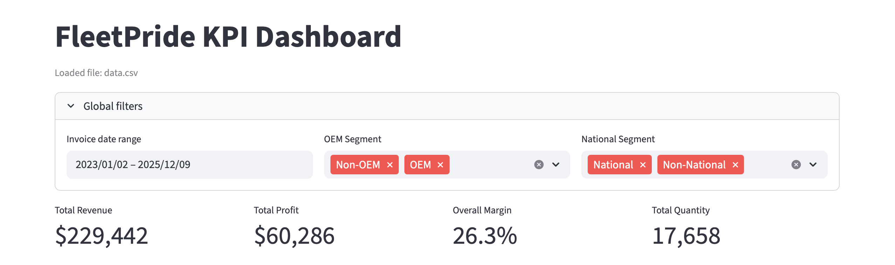

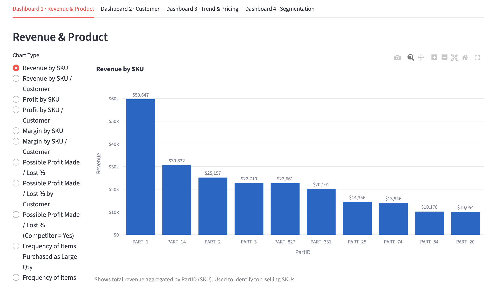
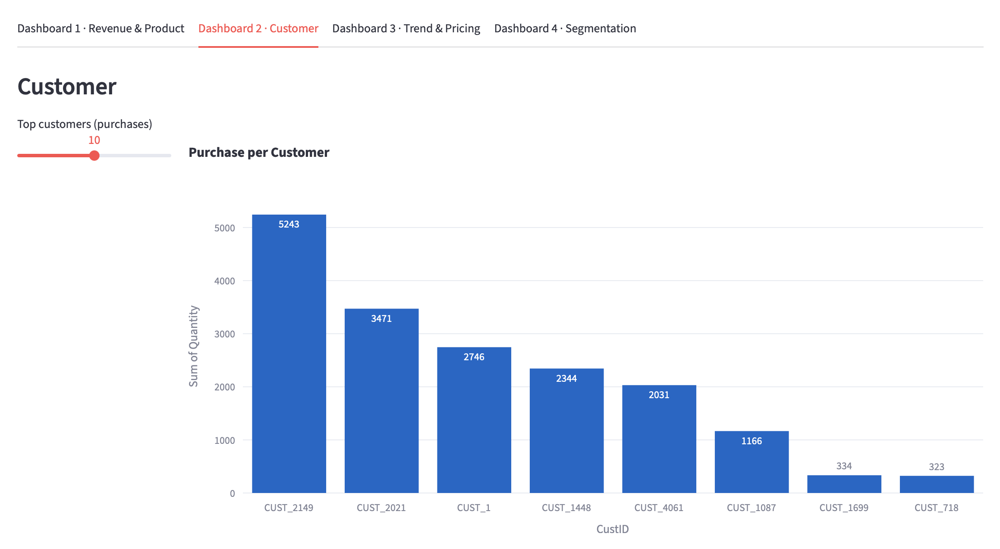
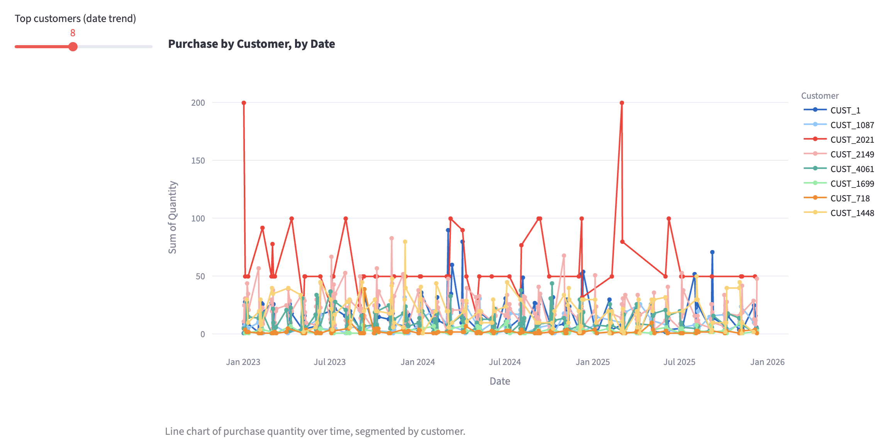
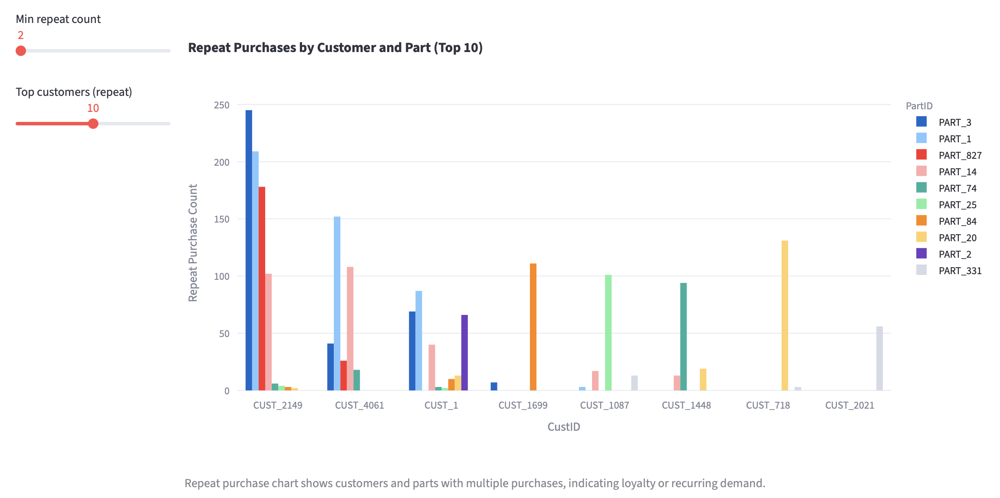
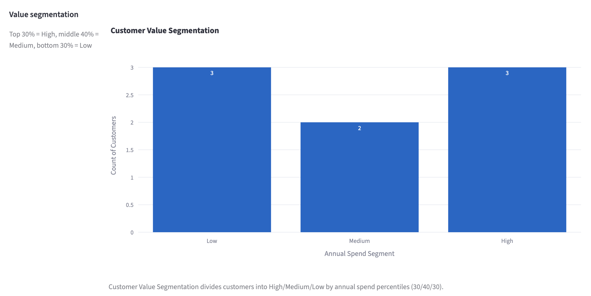
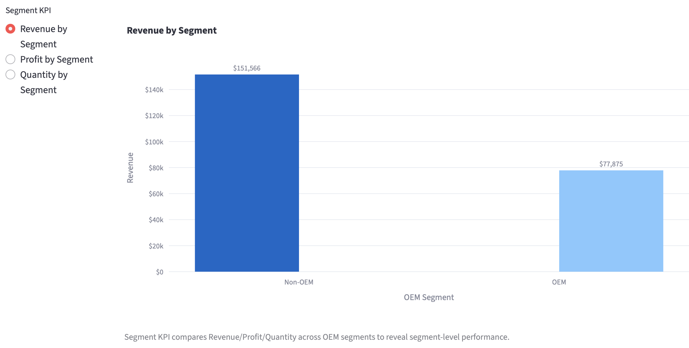
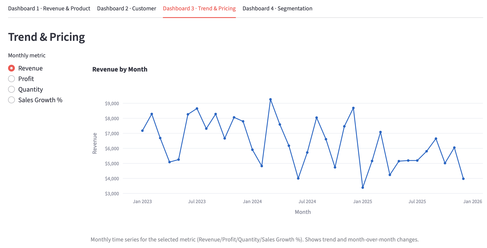
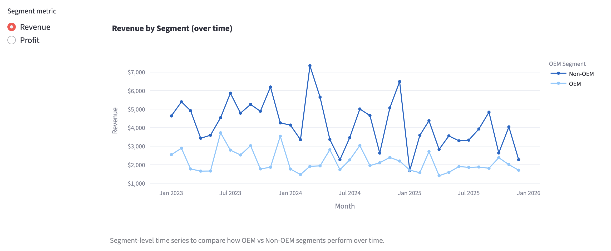
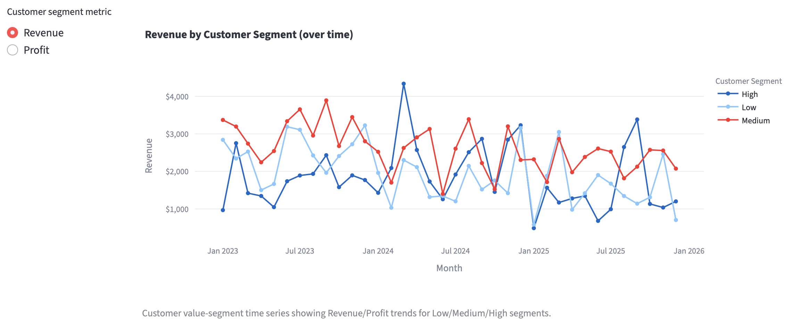
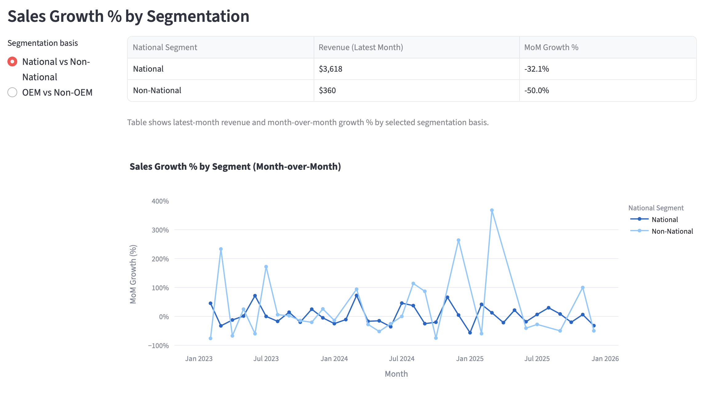
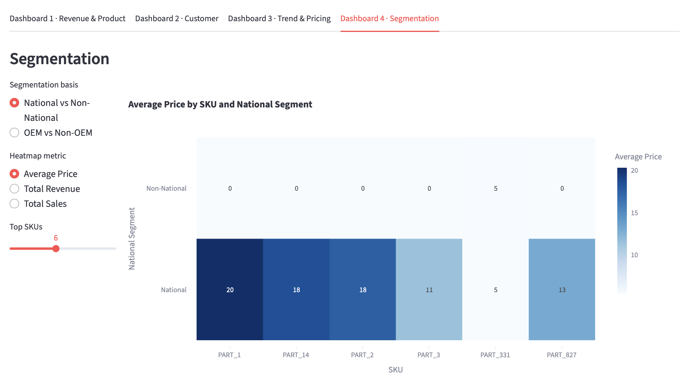

## Business Impact

The KPI dashboard bridges the gap between modeling and decision-making by:

- Making pricing insights accessible to non-technical stakeholders  
- Supporting data-driven pricing and revenue optimization decisions  
- Highlighting underperforming products and segments  
- Providing visibility into customer purchasing behavior  
- Enabling faster and more informed pricing strategy evaluation  

## Project Execution & Learning

This project involved real-world constraints, including delayed sponsor data. Instead of waiting, we proactively built a working prototype using synthetic data to develop the dashboard structure and KPI logic in advance.

By designing a modular and flexible system, we were able to seamlessly integrate sponsor data once it became available without disrupting the overall project timeline.

This experience strengthened my ability to:

- Work effectively under uncertainty  
- Maintain project momentum in real-world settings  
- Design scalable analytics solutions adaptable to changing data conditions  

## Tools Used

**Programming & Frameworks**  
Python, Streamlit  

**Data Processing & Analysis**  
Pandas, NumPy  

**Visualization**  
Plotly (Plotly Express)  

**Analytics Techniques**  
KPI Design, Segmentation Analysis, Price Elasticity Analysis, Trend Analysis 

## Next Steps

- Integrate full elasticity modeling outputs into the dashboard  
- Enhance pricing simulations and scenario analysis  
- Improve model interpretability for business stakeholders  
- Expand the prototype into a production-ready analytics solution 

<a href="Projects.html" class="learn-more-btn">Back to Projects</a>