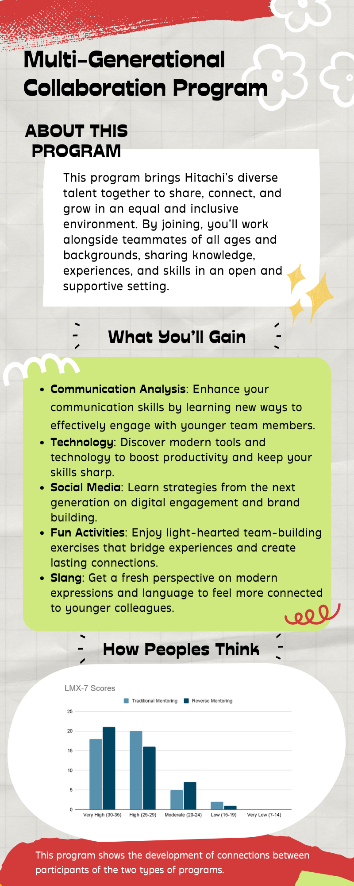
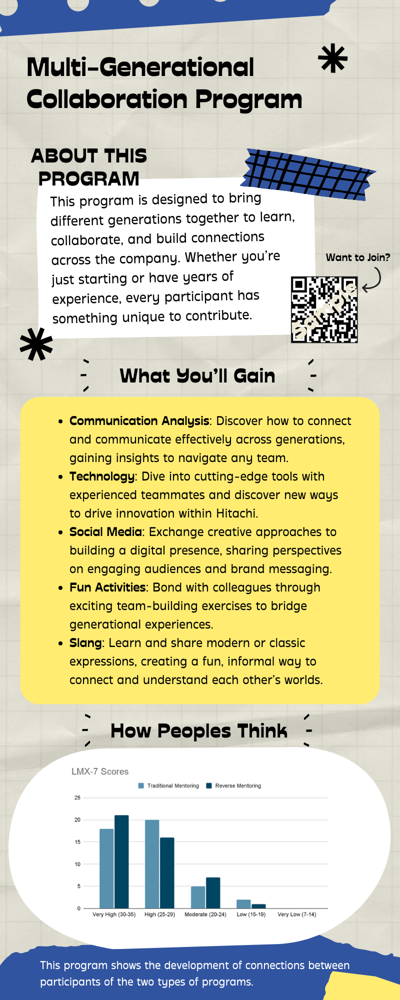
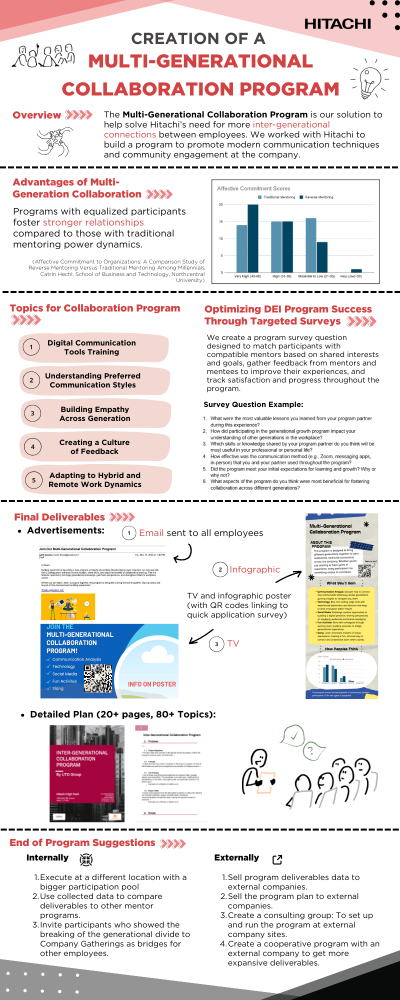

<a href="Projects.html" class="learn-more-btn">Back to Projects</a>

## Project Overview

The Hitachi Reverse Mentoring DEI Program was a client-facing consulting project focused on designing a structured multi-generational collaboration initiative for Hitachi. The project explored how reverse mentoring could strengthen communication, improve understanding across generations, and support a more inclusive and connected workplace environment.

Rather than launching the program directly, the team developed a practical foundation that Hitachi could use for future implementation. The project combined workplace research, program planning, communication materials, and implementation-oriented content into a unified deliverable designed for real organizational use.

## Key Achievements

- Contributed to the design of a structured reverse mentoring and multi-generational collaboration program
- Supported research on workplace communication across generations and reverse mentoring practices
- Helped develop client-ready materials that could support future internal rollout
- Designed infographic materials tailored to different generational audiences
- Supported the organization of program content into a clear and implementation-oriented final deliverable
- Helped translate DEI goals into a more practical and workplace-focused program framework

## My Contribution

I contributed to the development of the **Hitachi Reverse Mentoring DEI Program** by supporting the design of a workplace initiative aimed at improving communication and collaboration across generations.

My work focused on helping shape research-backed content and communication materials that could turn a broad DEI concept into a more structured and actionable program. In particular, I designed infographic materials tailored to different generational audiences, helping communicate the purpose, structure, and value of the proposed program in a more accessible and visually engaging way.

### Research and Program Development
- Supported research on reverse mentoring practices and multi-generational workplace communication
- Helped organize insights on how employees from different generations could learn from one another through structured interaction
- Contributed to the development of a program concept that connected employee engagement with communication improvement
- Assisted in shaping supporting content that strengthened the rationale behind the proposed initiative

### Communication and Content Support
- Designed infographic materials for different generational audiences to introduce and promote the program
- Created visual content that communicated the program’s purpose, structure, and value in a clear and engaging way
- Helped translate research findings into more accessible and audience-friendly messaging
- Contributed to communication materials that supported internal awareness and future program rollout

### Implementation-Oriented Project Support
- Helped develop supporting materials for participant understanding and future program rollout
- Contributed to content such as mindset readings, communication assets, and structured program guidance
- Assisted in organizing the final project output into a professional and client-ready format
- Supported the creation of a deliverable that was both research-informed and practical for business use

## Infographic Preview

{.hitachi-img}

Infographic I designed for the older generation audience to introduce the program and encourage participation.

{.hitachi-img}

Infographic I designed for the younger generation audience to introduce the program and encourage participation.

{.hitachi-img .hitachi-img-single}

Final infographic summarizing the overall concept and structure of the program.

## Business Impact

This project supported Hitachi in exploring a more structured approach to multi-generational communication, employee engagement, and inclusive workplace learning.

By developing research-backed program materials and communication assets, the project provided the client with a clearer path for future implementation. Instead of presenting reverse mentoring only as a concept, the team created a more practical framework that could help the organization communicate, support, and potentially launch the initiative internally.

The project also demonstrated how DEI-focused ideas can become more actionable when supported by research, structured planning, and clear communication design.

## Project Execution & Learning

This experience strengthened my ability to contribute to projects that connect workplace communication, organizational strategy, and structured program design.

Through this project, I gained hands-on experience in turning broad business and DEI objectives into practical deliverables that could support real implementation. I also developed a stronger understanding of how generational differences can influence communication and collaboration, and how thoughtful program design can help bridge those gaps in a professional environment.

The project strengthened my skills in research synthesis, content development, visual communication, and team-based project execution. It also gave me experience contributing to a client-oriented initiative where the final deliverable needed to be both well-supported and realistically usable.

## Tools Used

**Research & Program Design**  
Workplace Research, Reverse Mentoring Research, Multi-Generational Communication Analysis, Program Planning

**Content & Communication Materials**  
Infographic Design, Visual Communication, Internal Engagement Materials, Presentation Development

**Collaboration & Project Execution**  
Team Collaboration, Client-Facing Deliverables, Project Planning, Content Organization

<a href="Projects.html" class="learn-more-btn">Back to Projects</a>