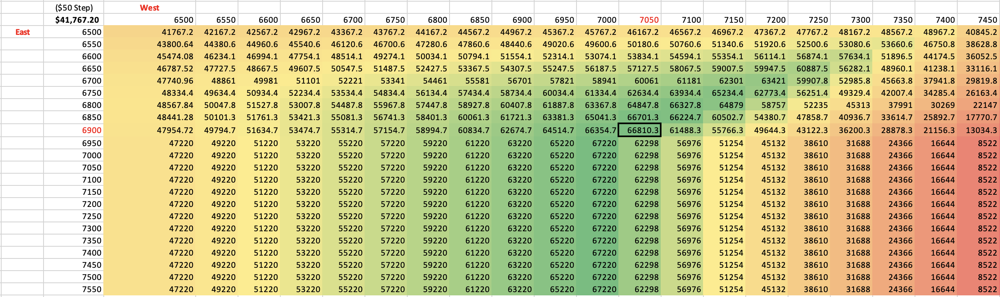
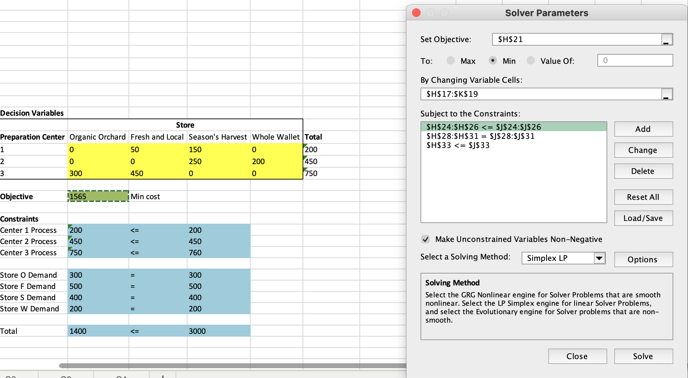
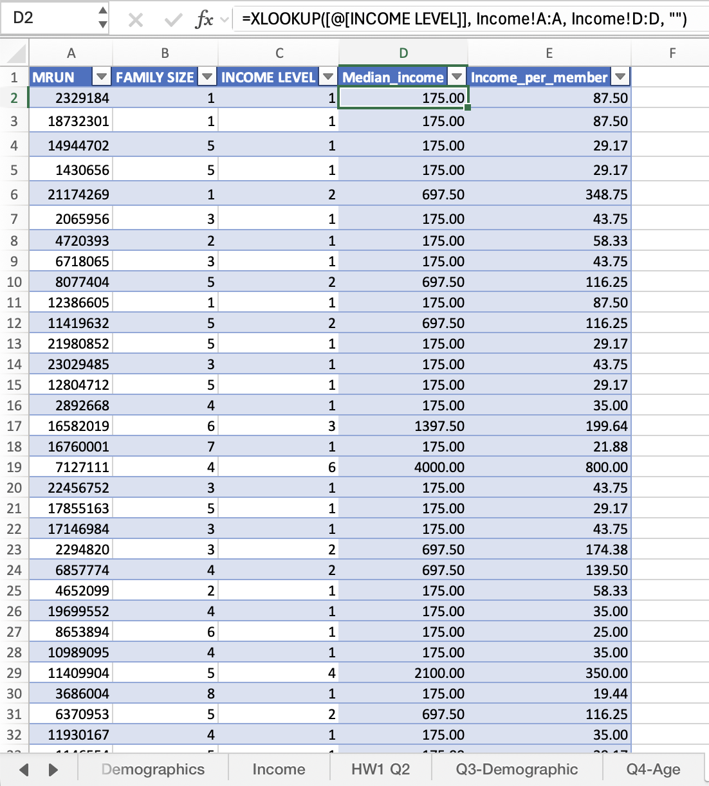
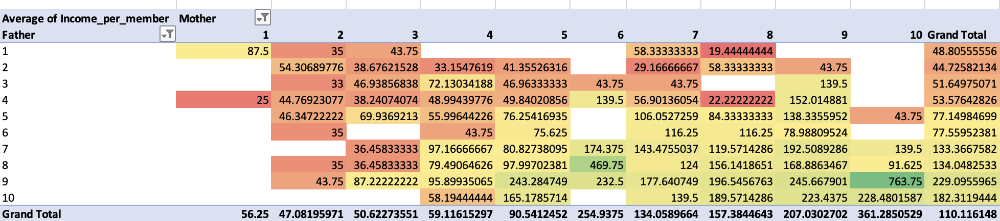

::: project-subtitle
Excel-based coursework in optimization, simulation, and decision analysis
:::

<a href="Projects.html" class="learn-more-btn">Back to Projects</a>

## Project Overview

This coursework focused on applying **spreadsheet modeling techniques in Excel** to solve **business decision problems** related to **pricing, optimization, uncertainty, and sequential decision-making**. Through a combination of modeling exercises and exam-based applications, I built structured spreadsheet models to evaluate trade-offs and support analytical decision-making.

The coursework emphasized turning business scenarios into organized frameworks by defining **inputs, decision variables, objective functions, and constraints**. It also strengthened my ability to use **Excel as an analytical and decision-support tool**, rather than only for basic calculations.

## Technical Methodology

I used **Microsoft Excel** to build and test spreadsheet-based decision models across several business contexts. My work involved using formulas, lookup functions, and optimization tools to organize data, compare alternatives, and interpret results.

The methods I applied included **What-If Analysis, Goal Seek, Data Tables, XLOOKUP, PivotTables, and Excel Solver**. In my modeling work, **XLOOKUP** was used to connect calculated outputs with their corresponding decision values, while **PivotTables** were used in supporting coursework exercises to summarize and explore dataset patterns across categories and time periods.

## Key Learning Outcomes

Through this coursework, I learned how to structure business problems into clear analytical models and evaluate decisions more systematically. I strengthened my ability to connect spreadsheet logic with practical business questions.

Some of the key skills I developed include:

-   Building **pricing and profit models** based on cost, demand, and revenue assumptions\
-   Using **Excel Solver** to optimize decisions under defined constraints\
-   Applying **XLOOKUP** to return relevant input or decision values from model results\
-   Using **PivotTables** to summarize and review supporting data efficiently\
-   Evaluating alternatives through **scenario analysis, simulation, and decision tree logic**\
-   Interpreting outputs and translating them into clearer **business recommendations**

### Excel Examples

#### What-If Analysis for Pricing Optimization

{.project-image}

::: excel-image-caption
This what-if analysis table compares multiple price combinations to identify the maximum total profit outcome. The highlighted cell shows the best result within the tested range and demonstrates how Excel can be used to support structured pricing analysis.
:::

#### Solver-Based Optimization Model

{.project-image}

::: excel-image-caption
This Solver-based optimization model identifies the most cost-efficient shipment plan from each preparation center to each store. The final solution minimizes total transportation and preparation cost to <strong>\$1,565</strong>, while meeting <strong>all store demand requirements</strong> and respecting <strong>processing capacity constraints</strong> at each center.
:::

#### XLOOKUP for Data Enrichment

::: excel-image-wrap

:::

::: excel-image-caption
This example shows how I used <strong>XLOOKUP</strong> to retrieve the corresponding <strong>median income</strong> for each <strong>income level</strong> from a cleaned reference table. I then divided that value by <strong>family size</strong> to create an <strong>income-per-member</strong> measure, allowing income to be compared more consistently across households of different sizes.
:::

#### PivotTable for Income Pattern Analysis

{.project-image}

This PivotTable summarizes the <strong>average income per household member</strong> by combinations of <strong>mother’s and father’s education levels</strong>. The pattern suggests that higher parental education is generally associated with higher household income, with a stronger upward trend appearing across the mother’s education levels.

## Business Value

This coursework demonstrates how **spreadsheet modeling** can support more structured and informed decision-making. It shows my ability to organize complex business problems, compare alternatives, and evaluate trade-offs between **cost, revenue, risk, and operational constraints**.

More importantly, it helped me understand how spreadsheet models can bridge **quantitative analysis** and **managerial decision-making** in a practical business setting.

## Tools Used

**Platform**\
Microsoft Excel

**Spreadsheet Techniques**\
Formula Modeling, **XLOOKUP**, **PivotTable**, What-If Analysis, Goal Seek, Data Tables

**Optimization Tools**\
**Excel Solver**

**Analytics Techniques**\
Profit Modeling, Scenario Analysis, Resource Allocation, Simulation, Decision Tree Analysis

<a href="Projects.html" class="learn-more-btn">Back to Projects</a>
